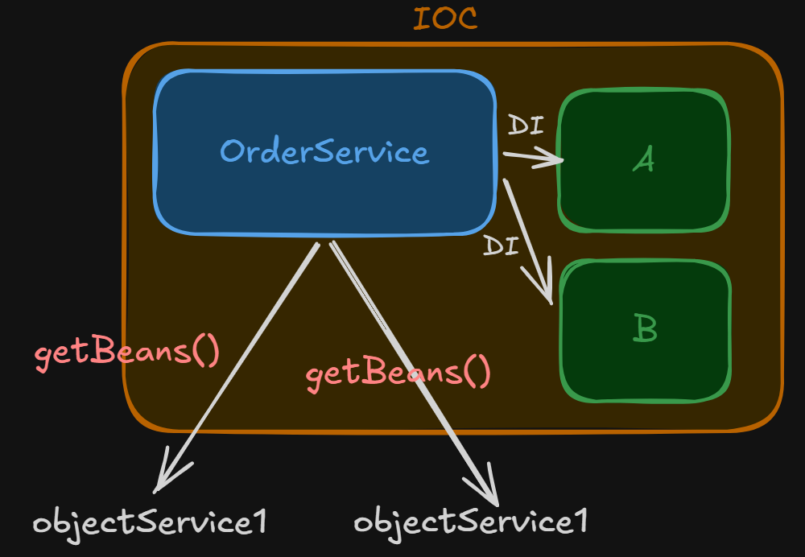
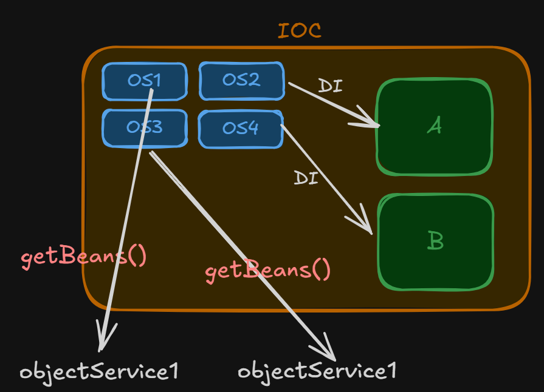

# Bean Scope
Go through the following code
```java
package org.example;
import org.springframework.context.ApplicationContext;
import org.springframework.context.annotation.AnnotationConfigApplicationContext;

public class Main {
    public static void main(String[] args) {
        ApplicationContext context = new AnnotationConfigApplicationContext(AppConfig.class);
        OrderService orderService1 = context.getBean(OrderService.class);
        OrderService orderService2 = context.getBean(OrderService.class);
        
        // check if both have same object or different
        System.out.println(orderService1 == orderService2); // true
    }
}
```
- So here as many times we call the getBeans(), we get the same one bean that was created and stored in IoC
- this is called `Singleton Scoped`.

---

## Bean Scopes:
- Singleton Scoped
- Prototype Scoped

### Singleton Scope
- One object for each class
- so each time we make getBeans() call, we get same object
- by default scope of beans is `singleton`
- it has `Eager initialization` (by default)



```java
package org.example;

import org.springframework.context.annotation.Scope;
import org.springframework.stereotype.Component;

@Component
@Scope("Singleton") // we can explicitly mention as well
public class OrderService {
    public OrderService(){
        System.out.println("Order Service Created");
    }

    public void placeOrder(){
        System.out.println("Order Placed");
    }
}
```
> Note: Singleton does not mean, we have only one object in IoC; it means that we have one object/bean per bean definition

```java
//AppConfig.java
package org.example;

import org.springframework.context.annotation.Bean;
import org.springframework.context.annotation.ComponentScan;
import org.springframework.context.annotation.Configuration;

@Configuration
@ComponentScan
public class AppConfig {
    // this is bean definition 1
    @Bean
    public OrderService getOrder(){
        return new OrderService();
    }

    // this is bean definition 2
    @Bean
    public OrderService getOrderService(){
        return new OrderService();
    }
}

```
- so here we have 2 distinct objects/beans of OrderService in IoC
- both are themselves singleton

### Prototype Scope
- Each time a new object is being created and provided
- each time we do getBean or via Dependency injection, new object
- it has `Lazy initialization` by default
> **Lazy Initialization**: means that, IoC container will up but the bean of OrderService will not be created. It will be created only when needed



```java
package org.example;

import org.springframework.context.annotation.Scope;
import org.springframework.stereotype.Component;

@Component
@Scope("prototype") // we can explicitly mention as well
public class OrderService {
    public OrderService(){
        System.out.println("Order Service Created");
    }

    public void placeOrder(){
        System.out.println("Order Placed");
    }
}
```

```java
// Main.java
package org.example;
import org.springframework.context.ApplicationContext;
import org.springframework.context.annotation.AnnotationConfigApplicationContext;

public class Main {
    public static void main(String[] args) {
        ApplicationContext context = new AnnotationConfigApplicationContext(AppConfig.class);
        OrderService orderService1 = context.getBean(OrderService.class);
        OrderService orderService2 = context.getBean(OrderService.class);

        // check if both have same object or different
        System.out.println(orderService1 == orderService2); // false
    }
}
```

- Output:
```text
Order Service Created
Order Service Created
Order Service Created
Order Service Created
false
```
> 4 times object is created, 2 times using getBeans(), and 2 times during Dependency Injection for Class A and Class B respectively.
---
## When to use which scope ?
- for `Stateful` class => Prototype
  - example for class User, if we make it singleton, every object will have same name and other details
  - but in actual we want different users so we make it prototype
  
- for `Stateless` class => Singleton
  - example: OrderService, PaymentService etc

---
## Other Scopes
- Request => new object for new http request
- Session => new object for new user session
- Application => same object throughout the application context or application is running

Etc many other

---

## @Lazy Annotation
- we know by default initialization is eager
- but we can make by using `@Lazy` annotation to the class whose bean creation need be made lazy
- thereafter, at time of IoC up, bean will not be created
- only when required, bean is initialised

```java
import org.springframework.context.annotation.Lazy;
import org.springframework.stereotype.Component;

@Component
@Lazy
class OrderService {
    
}
```
> **Note:** We can only make Singleton scope (which are by default Eager initialised) as lazy

> **Note:** We cannot make prototype scope (which are by default lazy) as eager

---
## Behavior of @Lazy when used for paramters

```java
import org.springframework.beans.factory.annotation.Autowired;
import org.springframework.stereotype.Component;

@Component
class OrderService {
    private PaymentService paymentService;

    @Autowired
    public OrderService(@Lazy PaymentService paymentService){
        this.paymentService = paymentService;
    }
    
    public void placeOrder(){
        paymentService.pay();
        System.out.println("Order Placed");
    }
}
```
- Here bean of OrderService will get created, due to Eager Initialization, same for PaymentService
- but wiring will not be done as we have used @Lazy
- when we call `paymentService.pay()` at that time wiring (dependency injection) will happen
- so here `proxy` of PaymentService is provided in OrderService constructor, so that bean creation of OrderService can be completed
- later during `paymentService.pay()` call, actual paymentService will be provided in place of proxy

> **Note:** `spring.main.lazy-initialization` property in application.properties; true => globally makes all classes lazy; default => false

> if globally all classes are made lazy, and one class you don't want to be lazy then use `@Lazy("false")`

---

## @Lazy can solve Circular Dependency
- Consider the same scenario, where OrderService depends on PaymentService and PaymentService depends on OrderService

```java
import org.springframework.context.annotation.Lazy;
import org.springframework.stereotype.Component;

@Component
class OrderService {
    private PaymentService paymentService;
    public OrderServie(@Lazy PaymentService paymentService) {
        this.paymentService = paymentService;
    }
    
    public void placeOrder(){
        paymentService.pay();
        System.out.println("Order Placed");
    }
    
    public void getOrderDetails(){
        System.out.println("Order Details");
    }
}
```

```java
import org.example.OrderService;
import org.springframework.context.annotation.Lazy;
import org.springframework.stereotype.Component;

@Component
@Lazy
class PaymentService {
    private OrderService orderService;
    public PaymentService(OrderService orderService) {
        this.orderService = orderService;
    }
    
    public void pay(){
        System.out.println("Payment done");
    }
}
```
### Explanation:
- Here when IoC container goes up, being Singleton class, due to Eager initialization, the bean of OrderService gets created
- But OrderService needs PaymentService, so there proxy is injected, not actual PaymentService bean and no actual wiring
- so by this way OrderService gets created
- now when inside `placeOrder()` when we call pay() at that time, bean of PaymentService is being initialised
- It asks for OrderService, so IoC provides is and bean gets created and this actual bean is then injected in place of proxy