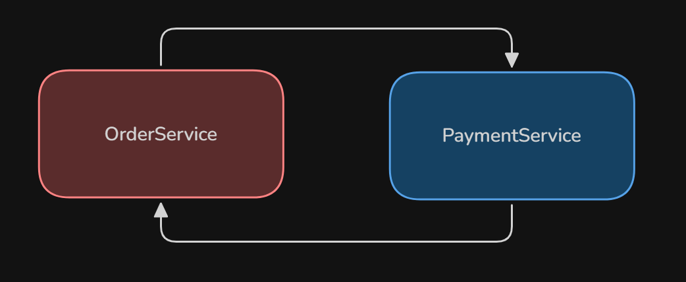

# Circular Dependency
The scenario which arises when creation of object of Class A requires object of Class B and also creation of Class B requires object of Class A

- its not because of spring, but its because of bad code practice
- check the /src/main/java/org.example/simple
  - we have 2 classes A and B, it goes infinitely creating each other's objects till stack overflow happens
  - this is because circular dependency happened

- In`Spring boot` we get `BeanCurrentlyInCreationException`
---
## Methods to resolve circular dependency in spring
- avoid using `Constructor injection`, rather use `Field Injection` or `Setter Injection`
- How it is working?
  - Take above example of OrderService and PaymentService itself
  - OrderService Empty Object will be created
  - PaymentService empty object will be created
  - Inject PaymentService to OrderService
  - Inject OrderService to PaymentService

- There are many other ways to resolve Circular Dependency but this scenario should not happen, its a bad coding practice
- In springboot v2.3 and above, this resolution method will not work only as an application propery named `spring.main.allow-circular-reference`: false