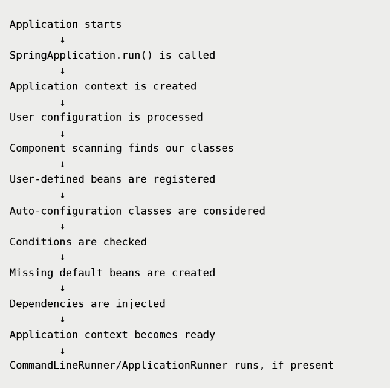

# Spring Boot Basics
- Every Spring application has following common startup work:
    - Start application
    - Create Spring container
    - Read configuration
    - Scan components
    - Create beans
    - Inject dependencies
    - Load properties
    - Prepare application context

- Spring boot solves this repetitve startup problem
- Spring boot does not replaces Spring Core
- Spring boot uses Spring core and gives us simpler way to start, configure and run the Spring Container

## Setting up Spring boot project
Two common ways:
1. Create a maven project and Spring boot dependencies in pom.xml
2. Use Spring Initializr to generate ready-made project structure

## Spring boot Starter
- it is dependency shortcut
- instead of adding many related dependencies one by one, we add one starter, and Maven brings the required  dependencies transitively

```xml
<dependency>
    <groupId>org.springframework.boot</groupId>
    <artifactId>spring-boot-starter</artifactId>
</dependency>
```

> `spring-boot-starter` is a basic starter for non-web springboot application

---

## Spring Boot Startup
- Spring boot gives a standard startup mechanism
- This line starts and prepares the Spring Application Context

```java
SpringApplication.run(MyApplication.class, args);
```

```java
package in.ricky

import org.springframework.boot.SpringApplication;
import org.springframework.boot.autoconfigure.SpringBootApplication;

@SpringBootApplication
public class MyApplication {
    public static void main(String[] args) {
        SpringApplication.run(MyApplication.class, args);
    }
}
```
---

## Understanding SpringApplication.run()
This line:
- starts spring boot application
- creates an application context
- Read configuration and properties
- Creates beans
- Applies auto-configuration
- injects dependencies
- Runs startup hooks like `CommandLineRunner`

> `run()` also returns application context

```java
ConfigurableApplicationContext context = SpringApplication.run(MyApplication.class, args);
```

- Technically we can still fetch beans manually as we were doing in Spring Core
```java
OrderService order = context.getBeans(OrderService.class);
order.placeOrder();
```

- But in real Spring Boot Application, this is not the actual and preferred approach
> Preferred approach is: let spring inject dependencies wherever they are needed

- if you deep dive into the SpringApplication.java file you will find following method that creates a context (IoC container) and returns it
```java
public ConfigurableApplicationContext run(String... args) {
}
```

> In `SpringApplication.run(SpringBootCoreDemoApplication.class, args)` we are passing `.class` of our main java class file of entire application, which is reflection concept that we have studied in SpringCore but there we used to pass Configuration class file but why we have passed main file's .class we will get to know later stay tuned.

---

## Understanding @SpringBootApplication annotation
- It is not just single annotation, it is `combination` of annotations
- It contains many annotations, but mainly we need to focus on following:
```java
@SpringBootConfiguration
@EnableAutoConfiguration
@ComponentScan
```

so following line in the main class SpringBootCoreDemoApplication.java:
```java
@SpringBootApplication
public class SpringBootCoreDemoApplication {
    // code
}
```

means below:
```java
@SpringBootConfiguration
@EnableAutoConfiguration
@ComponentScan
public class SpringBootCoreDemoApplication {
    // code
}
```

Purpose of 3 annotations:
| **Annotation** | **Purpose** |
| --- | --- |
| `@SpringBootConfiguration` | Marks the main configuration class of the Spring Boot application |
| `@EnableAutoConfiguration` | Enables Spring Boot's automatic configuration mechanism |
| `@ComponentScan` | Scan the current package and subpackages for Spring Components |

---

## Understanding @SpringBootConfiguration
- It is Spring Boot's version of `@Configuration` in Spring Core
- Like because of `@Configuration` allows us to write bean definitions
- Similarly, indirectly because of `@SpringBootApplication` annotation, we get `@SpringBootConfiguration` on SpringBootCoreDemoApplication class
- Therefore the main java class act as Configuration class file
- Therefore we pass `SpringBootCoreDemoApplication.class` in `SprintBootApplication.run()`, for creating context (IoC container)

- This means we can define beans in the main Class as well
```java
package in.ricky.SpringBootCoreDemo;

import in.ricky.UserService;
import org.springframework.boot.SpringApplication;
import org.springframework.boot.autoconfigure.SpringBootApplication;
import org.springframework.context.annotation.Bean;

@SpringBootApplication
public class SpringBootCoreDemoApplication {

	public static void main(String[] args) {
		SpringApplication.run(SpringBootCoreDemoApplication.class, args);
	}

    // Bean definition
	@Bean
	public UserService getUserService(){
		return new UserService();
	}
}
```
---

## Understanding @ComponenetScan
- In Spring Core we created AppConfig class and attached @ComponentScan, so by default in whichever package that configuration class is, in that package Spring will do component scan
- Scanning all component classes to maintain beans of that class
```java
@ComponentScan
class AppConfig {
    // configurations
}
```

- But we can change the scanning directory using the `basePackages` inside @ComponentScan
```java
@ComponentScan(basePackages = "in.ricky")
class AppConfig {
    // configurations
}
```

- Now in Spring Boot, we have @SpringBootApplication, which internally have @ComponentScan
- So @SpringBootApplication is attached to the main class of the application (Here, SpringBootCoreDemoApplication.java)
- So the main class becomes the configuration class and in whichever package the main class is, in that package and in its subpackages only the scanning will be done by default
- But we can change it using basePackages inside @SpringBootApplication
```java
@SpringBootApplication(basePackages = "in.ricky")
public class SpringBootCoreDemoApplication {
	public static void main(String[] args) {
		SpringApplication.run(SpringBootCoreDemoApplication.class, args);
	}
}
```

---

## Understanding @EnableAutoConfiguration
- This annotation tells Spring Boot that:
> Look at my project setup and automatically configure useful things for me

- Spring boot checks:
    - which dependencies are present
    - which classes are available on the classpath
    - which beans already exists
    - which properties are configured

- Then it creates useful default beans only when needed

For example Spring boot checks:
- Is a Web dependency present?
- Is a database dependency present?
- Is Spring Security present?
- Has developer already created custom bean?

> based on these checks, Spring Boot applies pre-written configuration classes.

Examples of auto-configuration classes:
- DataSoruceAutoConfiguration
- WebMvcAutoConfiguration
- JacksonAutoConfiguration
- TaskExecutionAutoConfiguration

> **Simple meaning:** @EnableAutoConfiguration = apply spring boot's ready-made configurations when contitions match

---

## Internal Working of Auto-Configuration
- When application starts
```java
SpringApplication.run(SpringBootCoreDemoApplication.class, args);
```
- Spring boot sees `@SpringBootApplication`, inside that it sees `@EnableAutoConfiguration` which enables auto-configuration
- Then spring boot considers auto-configuration classes
- These classes are not blindly applied. They are applied only when their condition matches

- Conceptually an auto-configuration class looks like below:
```java
@AutoConfiguration
@ConditionalOnClass(SomeLibrary.class)
public class SomeLibraryAutoConfiguration {
    @Bean
    @ConditionalOnMissingBean
    public SomeService getSomeService(){
        return new SomeService();
    }
}
```

> Meaning: if `SomeLibrary` is present in the project; AND developer have not created bean of `SomeService` manually; THEN create a default bean of `SomeService`

> Pre-written configuration + condition-based activation

### @ConditionalOnClass
@ConditionalOnClass is a condition that matches only when a particular class is present on the classpath

Simple meaning:
> apply this configuration only if a specific class or library is available in the project.

### @ConditionalOnMissingBean
This is a condition that matches only when a required bean is not already present in the spring container

Simple meaning:
> Create the bean only if the developer has not already created one.

This is important because Spring boot does not want to override our custom configuration unnecessarily


### Class-path based decision making
Classpath means set of classes and libraries available to the application at runtime

In Maven terms
```text
Dependency added in pom.xml
    |
    v
Maven downloads JAR files
    |
    v
Those JARs become available to the application
    |
    v
Spring boot checks available classes
    |
    v
Auto-configuration decisions are made
```

### Our Beans vs Auto-Configured Beans
In Spring Boot Application, beans can come from two main sources:
1. Breans created from our code
    - These are develope defined beans
    - Example using `@Component`
    ```java
    class PaymentService {
        public void pay(){
            System.out.println("Payment done!");
        }
    }
    ```
    - Example using `@Bean`:
    ```java
    @Configuration
    public class AppConfig {
        @Bean
        public PaymentService getPaymentService(){
            return new PaymentService();
        }
    }
    ```
2. Beans created by Spring boot auto-configuration
    - These beans comes from Spring boot's pre-written configuration classes
    - These are not classes we write in our application
    - They are provided by Spring Boot or by third-party starter

    ```java
    @AutoConfiguration
    @ConditionalOnClass(SomeLibrary.class)
    public class SomeLibraryAutoConfiguration {
        @Bean
        @ConditionalOnMissingBean
        public SomeService getSomeService(){
            return new SomeService();
        }
    }
    ```
---

## Complete Spring Boot Flow
A simplified spring boot startup flow looks like below:



---

## Final Takeaways:
- Spring boot does not replaces Spring Core
- Spring boot uses Spring Core internally
- Spring core gives us IoC and dependency injection
- Spring Boot gives us standard way to start and configure the application
- `SpringApplication.run()` creates and prepares the application context
- `@SpringBootApplication` combines `@SpringBootConfiguration`, `@EnableAutoConfiguration`, and `@ComponentScan`
- `@ComponentScan` finds our classes
- `@EnableAutoConfiguration` applies Spring boot's ready-made configurations
- Auto configurations works through conditions
- `@ConditionalOnClass` checks whether a class or library present
- `@ConditionalOnMissingBean` creates beans only when the developer has not already created one.
- Adding dependencies changes the classpath, and Spring Boot uses that classpath to decide what to configure
- A basic Spring Boot starter does not start a web server
- A Web starter adds web-related classes, so Spring Boot starts an embedded server