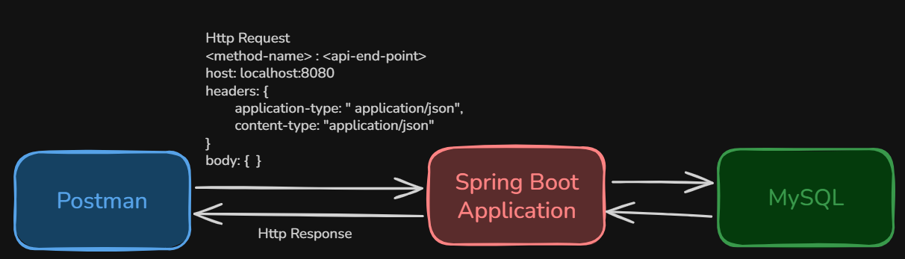
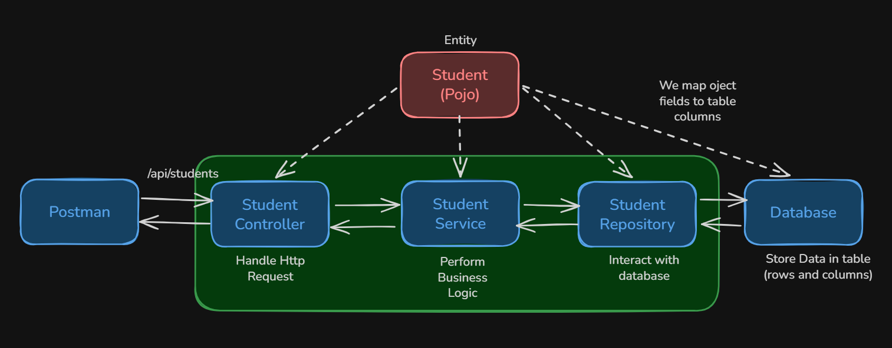
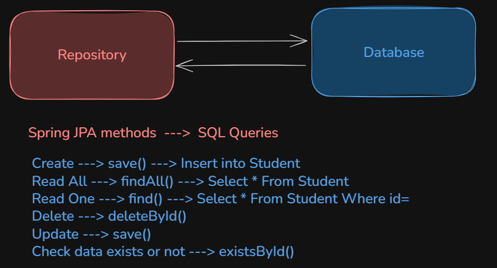

# Student Management System - Basic CRUD Application
- This is a basic crud application
- following is the architecture we are going to follow:



## Spring Boot Application configurations:
- **`Project:`** Maven
- **`Version:`** v4.1.0
- **`Project Metadata:`**
    - **`Group:`** com.ricky
    - **`Artifact:`** StudentManagementSystem
    - **`Package Name:`** com.ricky.StudentManagementSystem
- **`Packaging:`** Jar
- **`Configuration:`** Properties
- **`Java version:`** 17

## Dependencies required:
- Spring Web
- Spring Data Jpa
- MySQL Driver
---
## Steps for each operation
1. Listen to API endpoint
2. Perform Business Logic
3. Interact with DB
4. Return response back to client

> But we will not all in one file, we will separate out the responsibilities into different files


---

## Spring JPA interaction


- So first we will create an interface name StudentRepository
  - we make interface, if we make class then we have to define the jpa methods and have to write sql queries on our own
-  Extend `JpaRepository<Student, Long>`
  - Here is generics which accepts two parameters: 
    1. `Entity class` which need to handled by JPA
    2. `Data type of the primary key` of the entity class

> In Student Repository interface we extended JpaRepository interface, we are not implementing methods of JpaRepository, yet it works. How ?

- This is because `at runtime`, JPA provides the implementation of the methods
```java
package com.ricky.StudentManagementSystem.repositories;
import com.ricky.StudentManagementSystem.entities.Student;
import org.springframework.data.jpa.repository.JpaRepository;
import org.springframework.stereotype.Repository;

@Repository
public interface StudentRepository extends JpaRepository<Student, Long> { } 
```

### Spring JPA methods
1. `save()` - Create a new record or update a record
2. `findAll()` - Fetch all records from a table
3. `findById(id)` - Fetch record using the provided id
4. `deleteById(id)` - Delete a record whose id is provided
5. `existsById(id)` - Check if record of provided id exists or not
---

## Database connection
- for database connection we need to add few configurations in the `application.properties`
```properties
# MySQL Connection properties
spring.datasource.url=jdbc:mysql://localhost:3306/<db-name>
spring.datasource.username=<db-username>
spring.datasource.password=<db-password>
```

- Some other JPA related properties
```properties
# Following tells allows jpa to tell hibernate that internally you can create tables on you own, based on entity class
spring.jpa.hibernate.ddl-auto=update

# following will show the query ran at background in the terminal
# default value is false
spring.jpa.show-sql=true

# following allows to properly display the SQL Query ran by hibernate in terminal
spring.jpa.properties.hibernate.format-sql=true
```

- SQL Query to create database in MySQL
```sql
CREATE DATABASE student_db;
```
---

## Controller Class
- This class handles the incoming request, and returns response
- we attach `@RestController` annotation to the class
  - @RestController internally contains @Component, so bean of the controller class is handled by IoC
- If we know that for a Controller class, all end points have a common prefix we can use `@RequestMapping`
- Annotations for each Http Request methods:
  - `GET`: @GetMapping
  - `POST`: @PostMapping
  - `PUT`: @PutMapping
  - `DELETE`: @DeleteMapping

### Request Handling
> For end point with payload in body - Example: POST /api/students { "name": "Amrik Bhadra", "rollNo": 23, ... }
```java
@PostMapping("/api/students")
public Student createStudent(@RequestBody Student student) {
    // body
}
```

> For end point with path variable - Example: GET /api/students/3
```java
@GetMapping("/api/students/{id}")
public Student createStudent(@PathVariable Long id) {
    // body
}
```
> For end point with query params - Example: GET /api/students?id=3
```java
@GetMapping("/api/students")
public Student createStudent(@RequestParam Long id) {
    // body
}
```
### Response Handling
- We use `ResponseEntity<T>`
- Adding status code in response
  - `ResponseEntity.status(HttpStatus.OK)`
  - `ResponseEntity.ok()`
  - `ResponseEntity.created(...)`
  - `ResponseEntity.notFound().build()`

---

## Service Layer
- The service layer contains the business logic.
- The controller should only receive the request and pass it to the service.
- The service then interacts with the repository.
- We annotate the class with `@Service` so Spring creates a bean for it.

```java
@Service
public class StudentService {
    private final StudentRepository studentRepository;

    @Autowired
    public StudentService(StudentRepository studentRepository) {
        this.studentRepository = studentRepository;
    }
}
```

### Why use `@Service`?
- It marks the class as a business service component.
- Spring manages it through dependency injection.
- This keeps the code clean and separated by responsibility.

---

## Entity Class
- The `Student` class is an entity that maps to a table in the database.
- `@Entity` tells JPA that this class should be persisted.
- `@Id` marks the primary key field.
- Fields in the class become columns in the table automatically.

```java
@Entity
public class Student {
    @Id
    private Long id;
    private String name;
    private String email;
    private int age;
    private int rollNo;
    private String subject;
}
```

---

## CRUD Operations in the Service
- `createStudent()` → calls `studentRepository.save(student)`
- `getAllStudentService()` → calls `studentRepository.findAll()`
- `getStudentDetailsService()` → calls `studentRepository.findById(id)`
- `updateStudentService()` → finds the existing student, updates fields, and saves again
- `deleteStudentService()` → checks existence and then deletes

### Important Note about `Optional`
- `findById()` returns `Optional<Student>`.
- `Optional` helps avoid `NullPointerException`.
- We can check with `isPresent()` or `isEmpty()`.

```java
Optional<Student> student = studentRepository.findById(id);
if (student.isPresent()) {
    // do something
}
```

---

## Full Request Flow
1. Client sends an HTTP request.
2. Controller receives the request.
3. Controller calls a method in the service layer.
4. Service talks to the repository.
5. Repository interacts with the database using JPA.
6. Response is returned back to the client.

### Example flow for GET request
```java
@GetMapping("{id}")
public ResponseEntity<Student> getStudentDetails(@PathVariable Long id) {
    Student student = studentService.getStudentDetailsService(id);
    if (student == null) {
        return ResponseEntity.notFound().build();
    }
    return ResponseEntity.ok(student);
}
```
---

## Soft Delete
- Not deleting the data completing from the database
- marking the record as deleted by using a boolean field or other as per requirement
- so when fetching record, we can add this filter of `isDeleted` (suppose) field that it should be false

- For our application, for now we were fetching directly
```sql
SELECT * FROM students WHERE id = ?
```
> for this the method we have: `findById()`

- But now we have query like:
```sql
SELECT * FROM students WHERE id = ? AND isDeleted = false;
```
> We dont have pre defined functions for this

- But Spring Data Jpa has power that we can follow a syntax and can create a method name of our need and at run time JPA will add its implementation by understanding the method name

```java
 <prefix>By<property><operator><property><operator>...
```
```text
where
- prefix = what operation to perform
- By = starts the filtering conditions
- property = field name in your entity
- operator = optional comparison
```

### Query prefixes
Common ones are:
```java
findBy(...)
readBy(...)
getBy(...)
queryBy(...)
```

### `findAll()` is special case
This method already exists in JpaRepository.
```java
findAll()
```
> No implementation needed

Other examples which are also inherited.:
```java
findById(id)
save(entity)
deleteById(id)
existsById(id)
count()
```

### Conditions always start after `By`
```java
findByName(...)
findByAge(...)
findAllByAge(...)
```

> `Wrong:` findAllAndAge(...)


### Examples:
1. Equal
```java
findByName(String name)
```
```sql
WHERE name = ?
```

2. Two Conditions
```java
findByNameAndAge(String name, int age)
```
```sql
WHERE name = ? AND age = ?
```

3. OR
```java
findByNameOrEmail(String name, String email)
```
```sql
WHERE name = ? OR email = ?
```

4. Boolean field
    - if your entity has:
```java
private boolean isDeleted;
```
```java
findByIsDeletedTrue()
```
```sql
WHERE is_deleted = true
```

```java
findByIdAndIsDeletedFalse(Long id)
```
```sql
WHERE id = ?
AND is_deleted = false
```

5. Contains
```java
findByNameContaining(String keyword)
```
```sql
WHERE name LIKE '%keyword%'
```

6. StartsWith & EndsWith
```java
findByNameStartingWith(String prefix)
```
```sql
LIKE 'prefix%'
```

```java
findByNameEndingWith(String suffix)
```
```sql
LIKE '%suffix'
```

7. Ignore case
```java
findByNameIgnoreCase(String name)
```

8. Greater Than
```java
findByAgeGreaterThan(int age)
```
```sql
WHERE age > ?
```

9. Less Than
```java
findByAgeLessThan(int age)
```
```sql
WHERE age < ?
```

10. Between
```java
findByAgeBetween(int min, int max)
```
```sql
WHERE age BETWEEN ? AND ?
```

11. In
```java
findByAgeIn(List<Integer> ages)
```
```sql
WHERE age IN (...)
```

12. Not
```java
findByAgeNot(int age)
```
```sql
WHERE age <> ?
```

13. Null Checks
```java
findByEmailIsNull()
```
```sql
WHERE email IS NULL
```

```java
findByEmailIsNotNull()
```
```sql
WHERE email IS NOT NULL
```

14. Sorting
```java
findByAgeOrderByNameAsc()
```
```sql
WHERE age = ?
ORDER BY name ASC
```

```java
findByAgeOrderByNameDesc()
```
```sql
WHERE age = ?
ORDER BY name DESC
```

15. Top / First
```java
findTopByOrderByAgeDesc()
```
> Returns the oldest student.

```java
findFirstByOrderByAgeAsc()
```
> Returns the youngest student.

16. Exists
Instead of returning an entity, returns a boolean.

```java
existsByEmail(String email)
```

17. Count
Returns the number of matching records.

```java
countByIsDeletedFalse()
```

18. Delete
Spring Data JPA can also derive delete queries.

```java
deleteByEmail(String email)
```

---

### Property names must match the Entity

The property used in the repository method **must exactly match the Java field/property name** in the entity (not the database column name).

If the entity has:

```java
private String rollNo;
```

Then this is valid:

```java
findByRollNo(String rollNo)
```

But this is **invalid**:

```java
findByRollNumber(String rollNumber)
```

because `rollNumber` is not a property of the entity.

Similarly, if your entity has:

```java
private boolean deleted;
```

use:

```java
findByDeletedFalse()
```

not

```java
findByIsDeletedFalse()
```

---

### When to use `@Query`

Method-name query derivation is great for simple CRUD queries.

As queries become more complex (multiple joins, aggregations, subqueries, custom SQL, etc.), method names become long and difficult to maintain. In such cases, prefer using:

- `@Query` (JPQL)
- `@Query(nativeQuery = true)` (Native SQL)
- JPA Criteria API
- `Specification<T>` for dynamic queries
---

## DTO - Data Transfer Object
### Problems currently being faced
- Currently we are not checking for any data coming from client
    - suppose if client sends value of isDeleted or id etc
    - which was meant to be logically handled internally

- At present we are sending the exact student entity in response
    - issue with this that unwanted fields / sensitive data also like password, isDeleted etc will also go to client

- Client Contract should not break
    - like if in entity if we break `name` to firstName and lastName, then we have to tell client aswell to change at their end too

### Solution
- DTO: Data transfer object
- its nothing but a POJO class containing fields we want in request and response
- So we will have two types of dtos
    - RequestDTO
    - ResponseDTO

- So lets apply it in for Create Student first
```java
// CreateStudentRequestDTO.java

package com.ricky.StudentManagementSystem.dtos.request_dtos;

public class CreateStudentRequestDTO {
    private String name;
    private String email;
    private int age;
    private int rollNo;
    private String subject;

    // GETTERS
    public String getName() {
        return name;
    }
    public String getEmail() {
        return email;
    }
    public int getAge() {
        return age;
    }
    public int getRollNo() {
        return rollNo;
    }
    public String getSubject() {
        return subject;
    }
}
```

```java
// CreateStudentResponseDTO.java

package com.ricky.StudentManagementSystem.dtos.response_dtos;

public class CreateStudentResponseDTO {
    private Long id;
    private String name;
    private String email;
    private int age;
    private int rollNo;
    private String subject;
    private String message;

    // Setters
    public void setId(Long id) {
        this.id = id;
    }
    public void setName(String name) {
        this.name = name;
    }
    public void setEmail(String email) {
        this.email = email;
    }
    public void setAge(int age) {
        this.age = age;
    }
    public void setRollNo(int rollNo) {
        this.rollNo = rollNo;
    }
    public void setSubject(String subject) {
        this.subject = subject;
    }
    public void setMessage(String message) {
        this.message = message;
    }
}
```

```java
// StudentController.java

@PostMapping
    public ResponseEntity<CreateStudentResponseDTO> createStudent(
        @RequestBody CreateStudentRequestDTO studentReqDto
    ){
        CreateStudentResponseDTO createdStudent = studentService.createStudent(studentReqDto);
        return ResponseEntity.status(HttpStatus.CREATED).body(createdStudent);
    }
```

```java
// StudentService.java

public CreateStudentResponseDTO createStudent(CreateStudentRequestDTO studentReqDto) {
    Student student = new Student();
    student.setName(studentReqDto.getName());
    student.setEmail(studentReqDto.getEmail());
    student.setAge(studentReqDto.getAge());
    student.setRollNo(studentReqDto.getRollNo());
    student.setSubject(studentReqDto.getSubject());
    // set default value of variable for soft delete as false for new records
    student.setDeleted(false);

    // save the student
    Student studentResponse = studentRepository.save(student);

    // Create response and do mapping
    CreateStudentResponseDTO createStudentResponse = new CreateStudentResponseDTO();
    createStudentResponse.setId(studentResponse.getId());
    createStudentResponse.setName(studentResponse.getName());
    createStudentResponse.setEmail(studentResponse.getEmail());
    createStudentResponse.setAge(studentResponse.getAge());
    createStudentResponse.setRollNo(studentResponse.getRollNo());
    createStudentResponse.setSubject(studentResponse.getSubject());
    createStudentResponse.setMessage("Student created successfully!");

    return createStudentResponse;
}
```
> **NOTE**: In actual production code, we will have mapper class for mapping request dto to entity and mapping entity to response dto

> **NOTE**: Also we will not map one by one, we may miss any field; rather we will use builder class

---

## Data Validation
- we will use `spring-boot-starter-validation` dependency
```xml
<dependency>
    <groupId>org.springframework.boot</groupId>
    <artifactId>spring-boot-starter-validation</artifactId>
</dependency>
```

- Then in the DTO class, for the variables, we will add validation annotations:
```java
package com.ricky.StudentManagementSystem.dtos.request_dtos;

import jakarta.validation.constraints.Email;
import jakarta.validation.constraints.Min;
import jakarta.validation.constraints.NotBlank;
import jakarta.validation.constraints.NotNull;
import jakarta.validation.constraints.Size;

public class CreateStudentRequestDTO {
    // validations
    @NotBlank(message = "Name not provided.")  // cannot be null, empty or white spaces
    @Size(min = 2, max = 50, message = "Name should be between 2 to 50 characters long.")
    private String name;

    @NotBlank(message = "Email not provided.")
    @Email(message = "Invalid email format.")
    private String email;

    @NotNull(message = "Age not provided.")
    @Min(value = 18, message = "Student must be atleast 18 years old.")
    private Integer age;

    @NotNull(message = "Roll Number not provided.")
    private Integer rollNo;

    @NotBlank(message = "Subject not provided.")
    private String subject;

    // GETTERS
    public String getName() {
        return name;
    }
    public String getEmail() {
        return email;
    }
    public Integer getAge() {
        return age;
    }
    public Integer getRollNo() {
        return rollNo;
    }
    public String getSubject() {
        return subject;
    }
}
```

- Then in the `Controller` we will use `@Valid` annotation
```java
@PostMapping
    public ResponseEntity<CreateStudentResponseDTO> createStudent(
        @Valid @RequestBody CreateStudentRequestDTO studentReqDto
    ){
        CreateStudentResponseDTO createdStudent = studentService.createStudent(studentReqDto);
        return ResponseEntity.status(HttpStatus.CREATED).body(createdStudent);
    }
```

### Available Annotations for Validation

| Annotation | Used for | Meaning |
|------------|----------|---------|
| `@NotNull` | Any object | Value must not be `null`. |
| `@NotBlank` | `String` | Must not be `null`, empty (`""`), or contain only whitespace. |
| `@NotEmpty` | `String`, `Collection`, `List`, `Map`, `Array` | Must not be `null` or empty. |
| `@Size(min, max)` | `String`, `Collection`, `List`, `Map`, `Array` | Specifies the minimum and/or maximum size or length. |
| `@Min(value)` | Numeric types | Value must be greater than or equal to the specified minimum. |
| `@Max(value)` | Numeric types | Value must be less than or equal to the specified maximum. |
| `@Positive` | Numeric types | Value must be greater than `0`. |
| `@PositiveOrZero` | Numeric types | Value must be greater than or equal to `0`. |
| `@Negative` | Numeric types | Value must be less than `0`. |
| `@NegativeOrZero` | Numeric types | Value must be less than or equal to `0`. |
| `@Email` | `String` | Must be a valid email address. |
| `@Pattern(regexp = "...")` | `String` | Must match the given regular expression. |
| `@Past` | `Date`, `LocalDate`, `LocalDateTime`, etc. | Date/time must be in the past. |
| `@PastOrPresent` | Date/Time types | Date/time must be in the past or present. |
| `@Future` | Date/Time types | Date/time must be in the future. |
| `@FutureOrPresent` | Date/Time types | Date/time must be in the future or present. |
| `@AssertTrue` | `boolean`, `Boolean` | Value must be `true`. |
| `@AssertFalse` | `boolean`, `Boolean` | Value must be `false`. |

---

### Why Global Exception Handling?

Without Global Exception Handling, every controller/service method would need its own `try-catch` block.

```java
try {
    // business logic
} catch (Exception ex) {
    // return error response
}
```

This leads to:
- Duplicate code
- Difficult maintenance
- Inconsistent error responses

Instead, Spring Boot provides **Global Exception Handling** using:

- `@RestControllerAdvice`
- `@ExceptionHandler`

which centralizes exception handling for the entire application.

---

### Exception Flow

```
Client Request
      │
      ▼
Controller
      │
      ▼
Service
      │
      ▼
Exception Thrown
      │
      ▼
GlobalExceptionHandler
      │
      ▼
Error Response (JSON)
```

---

### @RestControllerAdvice

Marks a class as a **global exception handler**.

```java
@RestControllerAdvice
public class GlobalExceptionHandler {

}
```

It automatically intercepts exceptions thrown from any `@RestController`.

---

### @ExceptionHandler

Used to handle a specific exception type.

```java
@ExceptionHandler(ResourceNotFoundException.class)
public ResponseEntity<ExceptionResponseDTO> handleResourceNotFoundException(
        ResourceNotFoundException ex) {

}
```

Whenever `ResourceNotFoundException` is thrown, this method is executed automatically.

---

### Custom Exceptions

Java provides many built-in exceptions, but business logic often requires custom exceptions.

Example:

```java
public class ResourceNotFoundException extends RuntimeException {

    public ResourceNotFoundException(String message) {
        super(message);
    }
}
```

Another example:

```java
public class DuplicateResourceException extends RuntimeException {

    public DuplicateResourceException(String message) {
        super(message);
    }
}
```

Usage:

```java
throw new ResourceNotFoundException("Student not found");
```

---

### Using `orElseThrow()`

Instead of writing:

```java
Optional<Student> student = repository.findById(id);

if(student.isEmpty()){
    throw new ResourceNotFoundException("Student not found");
}

return student.get();
```

Prefer:

```java
return repository.findById(id)
        .orElseThrow(() ->
            new ResourceNotFoundException("Student not found"));
```

It is shorter and more readable.

---

### Validation Exception Handling

When validation fails (`@Valid`), Spring throws:

```java
MethodArgumentNotValidException
```

It can be handled globally:

```java
@ExceptionHandler(MethodArgumentNotValidException.class)
```

Extract all field errors:

```java
Map<String, String> fieldErrors = new HashMap<>();

ex.getBindingResult()
        .getFieldErrors()
        .forEach(error ->
            fieldErrors.put(
                error.getField(),
                error.getDefaultMessage()
            ));
```

Example response:

```json
{
    "timestamp": "...",
    "statusCode": 400,
    "error": "Bad Request",
    "message": "Validation Failed",
    "path": "/students",
    "fieldErrors": {
        "name": "Name not provided.",
        "email": "Invalid email format."
    }
}
```

---

### ResponseEntity

`ResponseEntity<T>` represents the complete HTTP response.

It allows us to customize:

- Status Code
- Headers
- Response Body

Example:

```java
return ResponseEntity
        .status(HttpStatus.NOT_FOUND)
        .body(exceptionResponse);
```

---

### ExceptionResponseDTO

Instead of returning plain text:

```text
Student not found
```

return a structured response.

Example:

```json
{
    "timestamp": "...",
    "statusCode": 404,
    "error": "Not Found",
    "message": "Student with id 10 not found.",
    "path": "/students/10"
}
```

Benefits:
- Consistent response format
- Easy for frontend to parse
- Easier debugging

---

### ValidationExceptionResponseDTO

Validation errors usually involve multiple fields.

Hence, along with the common fields, include:

```java
Map<String, String> fieldErrors;
```

Example:

```json
{
    "timestamp": "...",
    "statusCode": 400,
    "error": "Bad Request",
    "message": "Validation Failed",
    "path": "/students",
    "fieldErrors": {
        "email": "Invalid email format.",
        "name": "Name should be between 2 to 50 characters long."
    }
}
```

---

### Order of Exception Handlers

Always define handlers from **most specific** to **most generic**.

```
ResourceNotFoundException
        │
DuplicateResourceException
        │
MethodArgumentNotValidException
        │
RuntimeException
        │
Exception
```

Spring always chooses the **most specific matching handler**.

---

### Best Practices

- Throw custom exceptions from the Service layer.
- Keep controllers clean.
- Use `@RestControllerAdvice` for centralized exception handling.
- Return consistent JSON responses.
- Use meaningful exception messages.
- Keep a generic `Exception` handler as the last fallback.
- Prefer `orElseThrow()` over manually checking `Optional`.